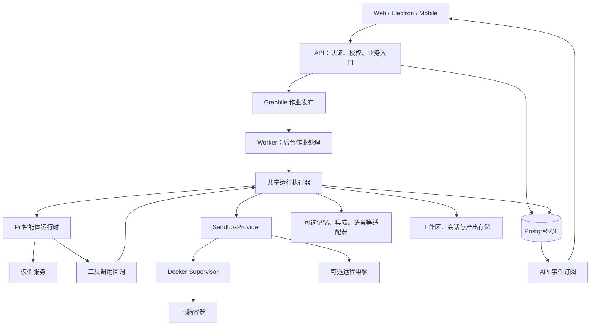
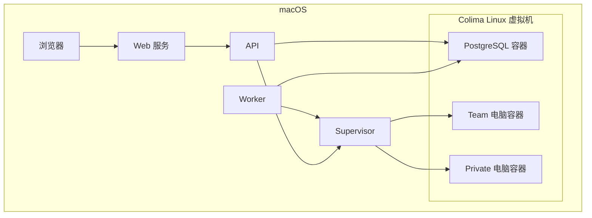
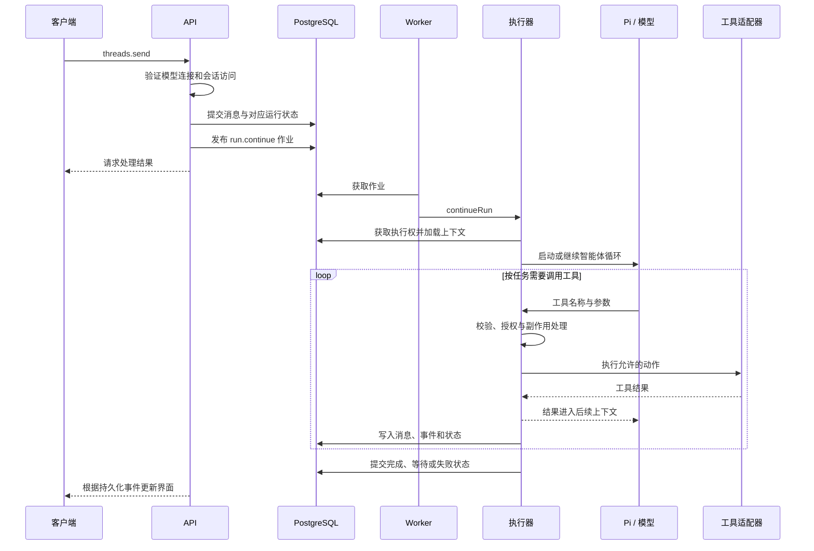

# Rakazo 设计理念与架构

Rakazo 是一个运行持久化 AI 机器人的平台：用户为机器人指定职责，通过对话或定时任务触发工作，机器人调用模型、工具和电脑完成任务，过程与结果由平台保存。

本文依据当前仓库的开发约定、共享接口和实现整理，重点解释默认的 Pi + Docker + Graphile 执行路径。远程沙盒、语音、外部应用和消息渠道通过各自适配器扩展。文中的“分层架构”等分类是对代码组织的概括，不表示每个目录都受到严格的编译期依赖约束。

模型与工具循环的内部机制另见 [Pi 设计理念与架构分析](pi-architecture.zh-CN.md)，以本仓库锁定的 Pi 版本为基线。

## 1. 核心设计理念

### 1.1 机器人是持久化的工作对象

Bot 保存名称、职责、指令、模型偏好及关联关系。对话、执行记录、记忆、例行任务和电脑工作区使它能够持续承担一类工作。

Bot 的存在不要求一个进程或浏览器始终运行。一次执行由 Run 表示，电脑和桌面有自己的生命周期。服务停止时，数据库中的机器人和任务配置仍可保留，但任务不能继续执行。

**设计收益：**用户围绕职责组织工作，可以回看任务结果，也可以用 Routine 再次触发同类工作。

**源码依据：**[数据库实体](../packages/db/prisma/schema.prisma)、[机器人创建与设置](../apps/web/src/pages/shell/bot-panel.tsx)。

### 1.2 前端表达意图，后端拥有编排

前端提交“发送消息”“停止运行”“批准动作”“打开电脑”等意图，并根据 API 返回和事件更新界面。身份、工作区权限、运行创建、工具授权、重试和恢复由后端负责。

这使 Web、Electron 和 Mobile 能复用同一套业务规则。Electron 承载 Web UI；Mobile 使用原生界面，并通过共享契约访问同一后端。共享产品不代表所有端的每个辅助界面都完全相同，例如[工具活动展示](tool-activity.md)明确记录了平台差异。

**源码依据：**[开发约定](../AGENTS.md)、[RPC 契约](../packages/contracts/src/rpc.ts)、[API 路由](../apps/api/src/router.ts)。

### 1.3 核心能力通过供应商无关的边界接入

模型、电脑、记忆、语音和外部集成都不应强制绑定某一家托管服务。共享接口表达产品需要的能力，具体适配器负责协议、SDK 和供应商数据转换，应用入口负责选择并组装实现。

例如，执行器通过 `SandboxProvider` 使用文件、命令和屏幕能力；Docker 或远程沙盒如何完成这些操作由适配器处理。模型连接也应优先使用现有通用协议与连接设置。

**收益与代价：**可以替换实现并使用 fake 实现做离线测试；同时必须维护能力差异、契约测试和各供应商的生命周期语义。接口相同不代表所有实现具备相同能力。

**源码依据：**[适配接口](../packages/adapter-kit/src/interfaces.ts)、[能力与数据类型](../packages/adapter-kit/src/types.ts)、[沙盒工厂](../packages/adapters/src/sandbox-factory.ts)。

### 1.4 智能体运行时和电脑运行时分开

Pi 负责与模型交互和推进智能体循环。电脑提供命令、文件、浏览器与图形桌面等执行能力。Rakazo 的共享执行器连接两者，并管理业务状态、授权、记忆和副作用。

在默认后台执行路径中，Pi 位于 Worker 进程内；测试中的内存作业路径可以在 API 进程内运行。Pi 不安装在机器人电脑容器中。模型服务又是独立边界，可以是远程 API，也可以是另行部署的兼容服务。

**收益：**更换电脑提供商不必重写模型循环，重建电脑也不等于删除 Bot 或聊天记录。

**源码依据：**[Worker 组装](../apps/worker/src/index.ts)、[API 组装](../apps/api/src/app.ts)、[电脑运行机制](computer-runtime.md)。

### 1.5 持久化、恢复和可验证性是执行设计的一部分

模型请求可能中断，外部动作可能成功但返回丢失，Worker 也可能退出。Rakazo 使用持久化运行状态、作业协调、租约与副作用记录处理这些情况。

不能把队列重试理解成任意动作都能安全重做，也不能推导出对所有外部系统都能保证“恰好一次”。执行结果未知时，平台需要保留这种不确定性，避免无条件重复操作。

默认测试使用模拟模型、fake 沙盒等可控输入。确定性测试验证执行机制；真实模型是否会选择正确动作，需要单独评估。

**源码依据：**[作业协调器](../packages/adapters/src/job-reconciler.ts)、[副作用回归测试](../packages/adapters/src/executor-effect-idempotency.test.ts)、[验证指南](agent-verification.md)。

## 2. 总体架构：三个不同视角

### 2.1 产品对象

| 对象 | 含义 | 与其他对象的关系 |
| --- | --- | --- |
| Space | 工作区与数据访问范围 | 组织机器人、对话、电脑等业务对象 |
| Bot | 持久化机器人配置 | 拥有指令、模型偏好，可关联电脑、任务和记忆 |
| Thread | 对话及事件序列 | 可以关联机器人、群组或外部会话 |
| Message | 一条结构化消息 | 属于 Thread；内容由消息块组成 |
| Task / Run | 工作任务与执行记录 | Run 关联任务、机器人和 Thread，保存状态、尝试与租约信息 |
| Computer | 工具运行环境的业务记录 | 多个 Bot 可以关联同一 Team Computer |
| Routine | 重复或事件触发的工作定义 | 经调度创建或推进运行 |
| Artifact | 产出物记录 | 与文件存储配合保存可查看的结果 |

Thread ID、Bot ID、Run ID 不能混用。一条消息也不应被简单等同于一个 Run：群组、运行中补充输入和继续执行都有自己的处理逻辑。

实体定义见[数据库 schema](../packages/db/prisma/schema.prisma)，发送和群组分发见[Thread 目标处理](../apps/api/src/thread-target.ts)。

### 2.2 逻辑组件

这是主路径的逻辑图。Graphile 使用 PostgreSQL 保存作业，不要求额外部署一个独立队列数据库。API 和 Worker 复用相同执行组件，但默认部署中后台作业由 Worker 消费；API 的内存作业运行方式主要用于测试。

### 2.3 Mac 源码部署

当前 Mac 源码部署把 Web、API、Worker、Supervisor 放在 macOS，Colima 承载 PostgreSQL 和电脑容器。其他 Compose 部署可以把应用服务也放入容器；这属于部署形态差异。

| 服务 | 主要职责 | 当前 Mac 部署端口 |
| --- | --- | --- |
| Web | 提供界面和相关代理入口 | `5173` |
| API | 业务接口、认证、授权、事件订阅 | `3100` |
| Worker | 执行后台作业、调度与恢复 | 不需要面向用户的 HTTP 端口 |
| Supervisor | 持有 Docker 管理能力，管理电脑容器 | `7091` |
| PostgreSQL | 业务数据、事件与队列持久化 | 宿主机映射 `5433` |

这些端口属于[当前 Mac 部署方案](self-host-mac-mini-checklist.md)，不是架构要求。一个机器人不对应一台 Colima 虚拟机；多个电脑容器使用同一个 Docker 运行环境。

## 3. 代码如何分层

代码组织可概括为共享包与多个应用入口组成的模块化系统。包目录是代码边界，API、Worker、Supervisor 等是进程边界，两者不一一对应。

| 目录 | 负责什么 | 二次开发时的判断 |
| --- | --- | --- |
| `packages/contracts` | RPC、事件、产品数据契约与校验 schema | 跨客户端的数据变化首先核对这里 |
| `packages/core` | 共享业务规则、纯逻辑及部分基础工具 | 多个入口应遵循的规则放在共享层 |
| `packages/adapter-kit` | 外部能力接口、上下文及数据类型 | 新接口应保护真实的能力边界 |
| `packages/adapters` | 执行器、Pi、模型、沙盒、队列与供应商适配 | 此包也包含执行编排，不能简单视为 SDK 封装集合 |
| `packages/db` | Prisma、实体查询、事务、事件持久化 | 数据访问与一致性处理 |
| `packages/auth` | 认证组件 | 身份建立与会话相关能力 |
| `packages/memory` | 基础记忆存储 | 与可选语义记忆适配器配合 |
| `packages/ui-tokens`、`ui-web`、`chat-ui` | 设计令牌与复用界面 | 复用已有视觉与聊天原语 |
| `packages/logging`、`testkit` | 日志、脱敏与测试设施 | 复用观测与离线验证能力 |
| `apps/api`、`apps/worker` | 入口和依赖组装 | 选择具体实现，连接共享组件 |
| `apps/web`、`desktop`、`mobile` | 用户界面与平台交互 | 共享行为与原生交互分别处理 |
| `infra/sandboxes` | Supervisor 与电脑镜像 | 电脑生命周期、浏览器和桌面执行 |

Hono 提供 API HTTP 服务，oRPC 和共享 schema 连接客户端与服务端；Prisma 访问 PostgreSQL；Graphile 消费后台任务；Pi 对接模型和工具循环。具体版本以包清单及锁文件为准。

## 4. 一次任务如何执行

### 4.1 从消息到运行

图示为普通后台执行的简化顺序；事件可在运行过程中持续回传，审批、取消和运行中补充消息会改变推进路径。入口链路是 `threads.send` → `sendThreadMessage` → `run.continue` → `continueRun`。

**阅读入口：**[RPC 契约](../packages/contracts/src/rpc.ts)、[Thread 处理](../apps/api/src/thread-target.ts)、[后台处理器](../packages/adapters/src/background-job-handlers.ts)、[执行器](../packages/adapters/src/executor.ts)。

### 4.2 模型与执行器的职责

模型根据当前上下文生成文字或工具请求。Pi 处理模型交互、流式输出和工具循环。执行器提供工具实现，并将平台的权限、运行状态、电脑、记忆和外部连接带入执行。

以 `read_file` 为例：工具定义描述参数 → Pi 接收模型调用 → 执行器解析工作区路径 → 沙盒读取字节 → 执行器检查大小和 UTF-8、脱敏 → 结果返回模型。模型声明“已写入文件”本身不构成文件确实存在的证据，需要工具结果或文件检查。

模型配置还涉及可用凭据、机器人模型偏好、工作区设置、输出限制和图片能力。通用协议兼容不自动代表模型具备可靠的工具选择或视觉能力。

**阅读入口：**[工具定义](../packages/adapters/src/builtin-tools.ts)、[Pi 运行时](../packages/adapters/src/pi-runtime.ts)、[模型选择](../packages/adapters/src/model-selection.ts)、[模型映射](../packages/adapters/src/pi-models.ts)。

### 4.3 事件如何回到界面

Thread 事件存入数据库，并有序列号。PostgreSQL 的 LISTEN/NOTIFY 通知订阅方有新内容；订阅逻辑按游标读取数据库事件，同时有补读机制。通知用于降低延迟，持久化事件才是恢复读取的依据。

客户端通过 API 的事件流消费变化；电脑的屏幕和控制通道另有专门传输与能力令牌，不能把聊天事件流与屏幕 WebSocket 混为一谈。

**阅读入口：**[事件存储与 follow](../packages/db/src/events.ts)、[实时通知](../packages/adapters/src/realtime.ts)、[客户端事件处理](../apps/web/src/lib/thread-events.ts)。

## 5. 电脑、数据和记忆

### 5.1 Team 和 Private

同一工作区默认共享 Team Computer。每个 Team 机器人有工作目录和独立浏览器资料，活跃时可获得自己的显示会话；文件和已安装工具仍处于共享电脑内。Private Computer 提供独立的电脑工作区。

在 Docker 提供商下，电脑对应容器。Team 的目录、浏览器资料与显示租约组织并发工作，但不构成相互不信任进程之间的隔离：Team 机器人共享 OS 用户，并能访问共享电脑中的文件。需要此类隔离时使用独立电脑。

桌面按需启动，闲置机器人不必各自保留一个 Chrome 进程。实际并发能力取决于资源和配置，机器人数量不能直接换算成固定内存占用。

### 5.2 各种状态存在哪里

| 数据 | 主要存储与作用 |
| --- | --- |
| Bot、Thread、Message、Run、Routine、Computer | PostgreSQL，保存产品对象与运行状态 |
| Thread 事件与 Graphile 作业 | PostgreSQL，支持事件补读和后台任务 |
| 基础 Markdown 记忆 | PostgreSQL 中的记忆文档与版本记录 |
| 可选语义记忆 | 通过记忆提供商适配器实现，范围与配置由平台处理 |
| Pi 会话录制 | 默认不启用；显式设置 `PI_SESSION_RECORDING=true` 后，在 `DATA_DIR/pi-sessions` 下写入 JSONL |
| 电脑工作区 | 通过 `AgentHomeStore` 管理，当前本地实现使用 `DATA_DIR` 下的持久目录 |
| 产出文件 | 文件存储与数据库元数据共同管理 |
| 凭据 | 通过秘密存储加密处理，与普通能力配置分开 |

`MarkdownMemoryStore` 中的 Markdown 表示内容形式，不表示它直接读写宿主机 Markdown 文件。Pi 的可选 JSONL 录制未加密，不能将它当作默认聊天持久化机制。聊天记录、模型会话、长期记忆和电脑文件有不同职责，不能作为彼此的替代备份。

Docker 电脑直接挂载平台拥有的工作区；远程电脑通过工作区导入、导出和检查点保存数据。当前本地工作区存储保存最新状态及检查点元数据，不是任意历史版本可回滚的归档。可移植工作区也不包含整个操作系统，工作区之外安装的软件需要镜像或安装步骤重建。

**阅读入口：**[基础记忆](../packages/memory/src/index.ts)、[会话管理](../packages/adapters/src/pi-session.ts)、[工作区存储](../packages/adapters/src/home.ts)、[持久化说明](computer-runtime.md#persistence)、[秘密说明](self-host-secrets.md)。

## 6. 权限、并发与恢复

| 机制 | 解决的问题 | 不应误解为 |
| --- | --- | --- |
| 身份与工作区权限检查 | 防止访问不属于当前授权范围的对象 | 只在前端隐藏按钮就足够 |
| 工具审批 | 控制执行动作及其获批参数 | 模型口头询问等于平台授权 |
| Run 租约与 fence | 控制执行所有权，拒绝失效持有者的后续写入 | 所有外部副作用自动具有事务性 |
| 电脑执行与控制租约 | 协调机器人执行、人接管和电脑维护 | Team 内恶意进程隔离 |
| 外部副作用记录 | 识别重复动作与结果未知的情况 | 任意失败动作都可以直接重试 |
| 作业协调器 | 从持久化状态发现漏入队等待恢复工作 | 无需考虑不可恢复故障 |
| 秘密加密、脱敏和屏幕能力令牌 | 缩小凭据与远程控制的暴露面 | 日志和截图天然可以公开 |

Supervisor 持有 Docker 管理能力，因此是高权限组件。API 通过受控接口管理电脑，不能因此把 Supervisor 当作普通公开 API。屏幕查看与控制使用可撤销的能力，服务端校验决定是否允许访问。

恢复也有明确限制：例如电脑维护任务在 Worker 失联后可能保留预留状态，避免破坏性操作被另一执行者重复执行；必要时需管理员确认旧操作已停止后释放。详见[电脑维护](computer-runtime.md#computer-maintenance)。

## 7. 测试架构与二次开发入口

| 验证层 | 真实部分 | 主要证明什么 |
| --- | --- | --- |
| 普通单测和契约测试 | 业务函数、适配代码 | 规则、参数与确定性行为 |
| Pi 离线测试 | Pi、HTTP/流解析、工具分发 | 模型协议与工具往返 |
| Postgres 集成测试 | API、数据库、执行器等 | 状态、权限、事务及恢复路径 |
| Docker 电脑回放 | Pi、Supervisor、Chromium、文件操作 | 指定电脑操作在真实环境中产生正确结果 |
| 真实模型评估 | 模型和产品执行路径 | 模型是否能为自然语言任务选择有效动作 |

这些层互相补充。回放通过不能说明模型理解任务的成功率；模型偶然成功也不能替代取消、授权和并发回归。完整命令与前置条件见[验证指南](agent-verification.md)。

| 二次开发目标 | 优先检查的边界 |
| --- | --- |
| 接入通用兼容模型 | 现有连接设置、模型解析与 Pi 协议测试 |
| 修改工具能力 | 工具 schema、共享执行器、沙盒能力、工具往返测试 |
| 新增电脑提供商 | `SandboxProvider`、能力声明、工厂与离线一致性测试 |
| 新增产品字段或操作 | 共享契约、数据库、后端授权、所有适用客户端 |
| 调整记忆 | 基础记忆与语义记忆接口、作用范围和清除语义 |
| 改善任务恢复 | Run 状态、作业协调、租约和副作用测试 |

实现新需求前，先描述它改变的产品行为，再确定共享规则、外部适配和平台交互分别在哪层。当前实现中的大型执行器和页面文件也意味着边界需要通过契约与测试维护；不能因为存在共享包就假设耦合已完全消除。

系统学习与实际改动可继续按[九周学习计划](learning-plan.zh-CN.md)执行。本文解释现有架构；学习计划中的 `read_file` 按行读取属于待完成练习，不应当作当前产品已具备的功能。
