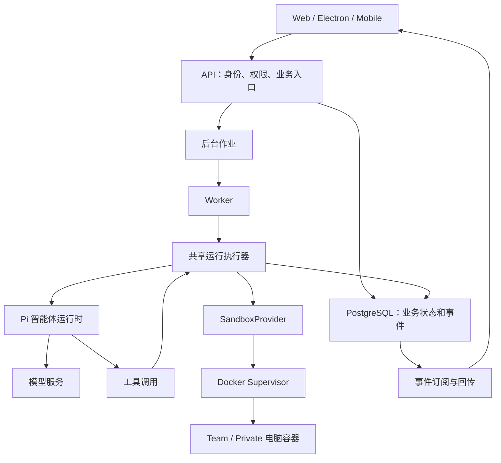

# Rakazo 系统学习与二次开发计划

适用于熟悉 TypeScript/React、每周可投入 6–8 小时的开发者。计划为期 9 周，约 54–72 小时，重点研究模型与智能体。已有源码部署可直接作为产品观察环境；本地模型不是前置条件，主要实验使用仓库的离线模型模拟器。

完成标准是能解释真实调用链、定位故障，并完成一项兼容现有行为的功能改动。本文是学习任务书，勾选框表示学习进度；下面的实验和实战功能需要执行后才能勾选。

## 使用方法

每周安排约 2 小时阅读、2 小时源码跟踪、2 小时实验、1 小时总结。未达到验收标准时顺延一周。先通过一个用户操作找到入口，再沿调用关系阅读；不要从头通读大型执行器或页面文件。

开始前在自己的学习笔记中记录基线：

```bash
git rev-parse HEAD
git status --short
node --version
pnpm --version
```

所有命令默认从仓库根目录运行。源码位置可能随版本变化，优先按本文提供的符号搜索。笔记中区分“从代码推断”和“实验验证”，记录命令、预期、实际结果与证据；公开材料使用虚构数据，不包含本机路径、密钥或会话令牌。

实验分为三类：产品观察使用当前部署；单测和模型协议实验使用离线夹具；数据库、取消、重试和恢复实验使用测试工具管理的隔离资源。需要 Docker 的测试仍需 Docker 运行时可用，首次拉取测试镜像也可能需要网络。

需要修改源码并观察页面时，先停止占用相同端口的已部署服务，再按[源码运行指南](self-host.md#local-source-checkout)启动开发服务。Mac 手动部署的操作见[部署清单](self-host-mac-mini-checklist.md)。不要同时运行两套同端口的服务。

## 项目地图与阅读入口

先阅读[设计理念与架构](architecture.zh-CN.md)建立整体认识，再按下列入口核对源码与实验。

### 设计理念

| 原则 | 要回答的问题 | 证据入口 |
| --- | --- | --- |
| 同一产品覆盖 Web、Electron、Mobile | 共享行为和原生交互如何划分？ | [开发约定](../AGENTS.md)、三个客户端 |
| 后端拥有业务编排 | 校验、权限、重试和恢复放在哪里？ | API、执行器、作业处理 |
| 外部能力可替换 | 更换模型或沙盒时哪些层不需要改变？ | 共享接口、适配器、组装入口 |
| 智能体与电脑运行时分离 | Pi 在哪里运行，电脑容器负责什么？ | [电脑运行机制](computer-runtime.md) |
| 状态可持久化和恢复 | 进程退出、漏入队或副作用结果未知时怎么办？ | 数据库、协调器、执行器测试 |
| 默认验证不调用真实服务 | 模拟测试能证明什么？ | [智能体验证指南](agent-verification.md) |

### 分层导航

| 位置 | 阅读目的 |
| --- | --- |
| [Web](../apps/web/src)、[Electron](../apps/desktop/src)、[Mobile](../apps/mobile) | 用户意图、共享能力与平台行为 |
| [共享契约](../packages/contracts/src) | RPC 输入输出、业务对象、事件 |
| [API](../apps/api/src) | 请求入口、身份与工作区权限、运行创建 |
| [数据库](../packages/db/src)、[schema](../packages/db/prisma/schema.prisma) | 数据关联、事务、持久化 |
| [Worker](../apps/worker/src/index.ts) | 后台组件组装和作业执行 |
| [核心逻辑](../packages/core/src) | 共享规则和纯逻辑 |
| [适配接口](../packages/adapter-kit/src) | 模型运行时、电脑等外部能力边界 |
| [适配实现](../packages/adapters/src) | 执行器、Pi、模型、沙盒、队列 |
| [记忆](../packages/memory/src) | 记忆读写与持久化 |
| [Supervisor](../infra/sandboxes/supervisor/src)、[电脑镜像](../infra/sandboxes/computer) | Docker 生命周期、浏览器、文件与桌面 |
| [测试工具](../packages/testkit/src) | 模型模拟器、产品旅程、电脑回放 |



这是重点研究的后台执行路径。API 也组装共享运行组件；第 3 周需要核实实际入口，不能据图推断所有执行都只发生在 Worker。

## 九周学习清单

### 第 1 周：理解产品和核心对象

**阅读：**[README](../README.md)、[开发约定](../AGENTS.md)、[贡献指南](../CONTRIBUTING.md)，浏览聊天、Computer、Files、Routines 和机器人设置。

- [ ] 记录学习基线和当前工作区改动。
- [ ] 与 Chief 完成一次有明确交付物的小任务。
- [ ] 请求机器人创建 `learning/hello.txt`，内容为 `hello rakazo`，从 Files 核对实际文件。
- [ ] 查看 Computer 的屏幕和操作记录，区分聊天文本与实际工具执行。
- [ ] 查看机器人模型选择、Team/Private 电脑和 Routine 设置。
- [ ] 整理 Space、Bot、Thread、Message、Run、Computer、Routine 的含义及关联。

没有可用模型时，先完成界面观察，将模型执行步骤标为待补；第 4 周完成离线工具往返后再核对理解，不把未执行的任务记为成功。

**产出：**产品概念表、一次任务的输入与结果记录。

**验收：**能解释机器人与电脑为何不是一一对应；能区分关闭页面、停止机器人运行和停止整套服务；能说明哪些能力需要模型、电脑或外部集成。

### 第 2 周：理解分层与依赖方向

**阅读顺序：**[API 组装](../apps/api/src/app.ts) → [Worker 组装](../apps/worker/src/index.ts) → [适配接口](../packages/adapter-kit/src/interfaces.ts) → [沙盒工厂](../packages/adapters/src/sandbox-factory.ts)。

- [ ] 通过各包的 `package.json` 画出主要依赖关系。
- [ ] 找出 `AgentRuntime`、`SandboxProvider` 和 `createRunExecutor`。
- [ ] 比较 Docker 与 fake 沙盒如何实现相同能力。
- [ ] 找出 Web 和 Mobile 的 RPC 入口，观察 Electron 复用 Web 的方式。
- [ ] 解释配置和具体供应商实现为什么集中在适配器与组装入口。

```bash
rg -n 'AgentRuntime|SandboxProvider' packages/adapter-kit/src
rg -n 'createRunExecutor|PiAgentRuntime|createRunSandbox' apps/api/src/app.ts apps/worker/src/index.ts
```

**产出：**组件图，以及三条设计笔记，每条包含“问题、当前方案、代价、代码证据”。

**验收：**对于新增模型能力、聊天交互、电脑提供商三个需求，能指出改动层、可复用接口和所需测试。

### 第 3 周：追踪一条消息的完整生命周期

**阅读顺序：**[客户端 RPC](../apps/web/src/lib/rpc.ts) → [共享 RPC 契约](../packages/contracts/src/rpc.ts) → [API 路由](../apps/api/src/router.ts) → 数据库和作业 → [客户端事件处理](../apps/web/src/lib/thread-events.ts)。

- [ ] 搜索 `threads.send`，找到页面发送入口与契约。
- [ ] 跟踪身份、工作区和机器人访问权限如何得到验证。
- [ ] 找到 Message、Run 的创建事务及入队位置。
- [ ] 跟到后台处理器和运行执行器。
- [ ] 记录事件的持久化、订阅和界面更新过程。
- [ ] 观察一次浏览器请求和事件流，不公开完整认证或能力 URL。

```bash
rg -n 'threads\.send|send: authed\.threads' apps packages/contracts/src
rg -n 'runContinueJob|createBackgroundJobHandlers' apps packages/adapters/src
```

**产出：**一张时序图，每条箭头标明调用符号；一条使用虚构 ID 的 Message、Run、Thread 关联记录。

**验收：**能指出“请求被接受”和“任务完成”分别在哪判断；能说明漏入队时持久化的运行如何继续被发现。

### 第 4 周：理解 Pi、模型连接和工具往返

先读 [Pi 设计理念与架构分析](pi-architecture.zh-CN.md)，区分 Pi 框架能力与 Rakazo 的接入策略。

**阅读顺序：**[模型选择](../packages/adapters/src/model-selection.ts) → [Pi 模型映射](../packages/adapters/src/pi-models.ts) → [Pi 运行时](../packages/adapters/src/pi-runtime.ts) → [模型模拟器](../packages/testkit/src/model-emulator.ts) → [离线 Pi 测试](../packages/testkit/src/pi-offline.test.ts)。

- [ ] 运行 `pnpm test:pi`，记录基线结果。
- [ ] 跟踪模型 ID、凭据、图片能力和输出限制的传递。
- [ ] 阅读一个文本响应用例和一个工具往返用例。
- [ ] 手动画出第一次模型请求、工具调用、真实工具结果和下一次请求。
- [ ] 阅读分段工具参数、模型失败、流中断和取消的用例。
- [ ] 说明 Pi 和模型服务各自负责什么。

```bash
pnpm test:pi
pnpm exec vitest run packages/adapters/src/pi-runtime-models.test.ts
pnpm exec vitest run packages/adapters/src/pi-runtime-cancellation.test.ts
```

**产出：**模型交互时序图，以及“连接配置 → 实际模型请求”的映射表。

**验收：**能区分 HTTP 成功、流完整结束、工具成功和任务成功；知道脚本化智能体和真实 Pi 配合模拟模型不是同一层测试。

### 第 5 周：理解工具执行与电脑边界

**阅读顺序：**[工具定义](../packages/adapters/src/builtin-tools.ts) → [执行器](../packages/adapters/src/executor.ts)中的 `read_file` → [电脑工作区](../packages/adapters/src/computer-workspace.ts) → [Docker 适配器](../packages/adapters/src/docker-sandbox.ts) → Supervisor。

- [ ] 跟踪 `read_file` 参数如何从模型到达执行器。
- [ ] 找出路径转换、大小限制、UTF-8 解码与秘密脱敏。
- [ ] 对照 `shell` 的授权与实际执行路径。
- [ ] 阅读批准、拒绝和只读动作相关测试。
- [ ] 解释 Team 文件共享、独立浏览器资料与安全边界的关系。
- [ ] 阅读电脑停止、工作区保存和替换恢复流程。

```bash
rg -n 'name: "read_file"|name === "read_file"|MAX_MODEL_FILE_BYTES' packages/adapters/src
pnpm exec vitest run packages/adapters/src/executor-readonly-approval.test.ts
pnpm exec vitest run packages/adapters/src/sandbox-conformance.test.ts
```

**产出：**工具链路图与边界表：哪一层负责输入校验、授权、文件访问和输出限制。

**验收：**能解释 Team 的机器人目录为什么不是互不信任进程之间的隔离边界；能区分 Docker 虚拟机、电脑容器和 Pi 运行进程。

### 第 6 周：理解状态、恢复和上下文

**阅读顺序：**[数据库 schema](../packages/db/prisma/schema.prisma) → [事件存储](../packages/db/src/events.ts) → [后台处理器](../packages/adapters/src/background-job-handlers.ts) → [作业协调器](../packages/adapters/src/job-reconciler.ts) → [Pi 会话](../packages/adapters/src/pi-session.ts)与[记忆实现](../packages/memory/src/index.ts)。

- [ ] 画出核心数据库实体的关系。
- [ ] 从代码提取真实运行状态，整理正常完成、等待批准、取消和失败的转换。
- [ ] 跟踪入队失败后的协调恢复。
- [ ] 阅读副作用幂等测试，区分未执行与结果未知。
- [ ] 列出聊天记录、Pi 会话、记忆和工作区文件的存储位置及用途。
- [ ] 通过测试夹具模拟故障，记录预期和实际状态。

```bash
pnpm exec vitest run packages/adapters/src/executor-effect-idempotency.test.ts
pnpm exec vitest run packages/adapters/src/job-reconciler.test.ts
```

**产出：**运行状态图、数据保存位置表、故障定位表。

| 现象 | 首先沿哪些证据调查 |
| --- | --- |
| 页面没有发出请求 | 输入状态、事件处理、客户端 RPC |
| 消息存在但运行没有推进 | 持久化状态、作业入队、Worker、协调器 |
| 模型回复但工具未执行 | 工具参数、授权、执行器 |
| 工具成功但页面未更新 | 事件写入、订阅、客户端事件处理 |
| 替换电脑后文件缺失 | 工作区保存和恢复路径 |

**验收：**能够根据证据缩小故障范围，并解释为什么不确定是否完成的外部动作不能直接重放。

### 第 7 周：掌握验证体系

**阅读：**[贡献指南的测试矩阵](../CONTRIBUTING.md#checks-before-you-open-a-pr)、[智能体验证指南](agent-verification.md)、[测试启动器](../packages/testkit/src/cli/harness.ts)。

- [ ] 运行一个测试文件，再用 `-t` 选择其中一个测试。
- [ ] 核对普通单测是否跳过需要数据库或其他基础设施的用例。
- [ ] 使用官方启动器运行数据库集成测试，确认临时数据库隔离。
- [ ] Docker 可用且电脑镜像已构建时执行电脑回放。
- [ ] 为每层测试填写真实组件、替代组件和证明范围。
- [ ] 完成下一周功能的设计说明和测试清单。

```bash
pnpm exec vitest run packages/adapters/src/pi-runtime-cancellation.test.ts -t 'does not dispatch another tool after cancellation'
pnpm test:integration
pnpm test:computer-replay --image=rakazo/computer:local
```

`test:integration` 通过启动器创建临时 Postgres 并设置验证环境。直接执行某个 `.postgres.test.ts` 时可能因缺少条件而跳过，不能将跳过视为通过。测试启动器会生成客户端或报告等产物，结束后检查工作区差异。

**产出：**测试选择表与实战设计说明。

**验收：**能解释确定性回放只证明指定行为，真实模型是否能选对动作需要额外评估。Mac 上不例行运行会打开 Electron 窗口的桌面 E2E。

### 第 8 周：为 read_file 增加按行读取

当前工具读取大小限制内的整个 UTF-8 文件。实战目标是让机器人只请求所需行，减少无关文本进入上下文，复用已有路径解析、读取与脱敏边界。

- [ ] 检查工作区已有改动，创建独立学习分支，不将无关改动混入提交。
- [ ] 记录相关测试基线。
- [ ] 按下节任务书扩展现有工具参数。
- [ ] 添加并运行参数、截取和兼容性单测。
- [ ] 接入共享执行器，复用现有文件大小和权限限制。
- [ ] 用真实 Pi 与离线模型夹具验证参数往返。
- [ ] 在产品集成测试中验证工具结果和运行结果。

**产出：**功能补丁、测试和接口变化说明。

**验收：**至少覆盖“模型参数 → 执行器 → 文件结果 → 模型下一轮请求”；辅助函数测试通过不足以代表完整功能通过。

### 第 9 周：验证、交付与复盘

- [ ] 完成实战测试矩阵，检查旧调用兼容性。
- [ ] 执行 lint、类型检查、单测和受影响集成测试。
- [ ] 有可用模型时做一次真实任务验收，单独记录它与确定性验证的差异。
- [ ] 检查 diff 和暂存区，确认没有密钥、个人数据或无关改动。
- [ ] 整理为什么改、改了什么、如何验证、有哪些限制。
- [ ] 做一次 15 分钟讲解，从用户请求讲到模型、工具、电脑和结果返回。
- [ ] 将待深入的问题整理为下一阶段清单。

```bash
pnpm lint
pnpm check
pnpm test
pnpm test:pi
pnpm test:integration
git diff --check
git diff --stat
git status --short
git diff --cached
```

**产出：**可评审补丁、架构笔记、实验记录和复盘。提交上游 PR 属于独立动作；若创建 PR，按仓库的 PR 观察流程跟进 CI 与自动审查。

**验收：**能解释每处改动为什么位于该层，能够为另一个需求给出接口影响和测试方案。

## 实战任务书：read_file 按行读取

### 接口与兼容性

在现有 `path` 参数上增加可选整数 `start_line` 和 `end_line`。行号从 1 开始，包含结束行。

| 输入 | 行为 |
| --- | --- |
| 两个参数都省略 | 保持原有全文读取结果 |
| 只传 `start_line` | 从指定行到文件末尾 |
| 只传 `end_line` | 从第一行到指定行 |
| 两个都传 | 返回闭区间内的行 |
| 0、负数、小数、非数值 | 明确的工具参数错误，不读取文件 |
| 结束行小于开始行 | 明确的工具参数错误，不读取文件 |
| 开始行超过总行数 | 返回空内容 |
| 结束行超过总行数 | 截到实际末尾 |

工具结果保持现有 `{ path, content }` 结构，不新增 RPC、数据库字段或客户端设置。schema 和执行器都应约束输入，避免直接调用绕过模型侧校验。不要将字符串参数隐式转换为数字。

空文件为 0 行；LF 和 CRLF 均视为行分隔符；末尾换行不增加额外空行。保留所选行的原始文本及其原有换行：`a\nb\nc\n` 读取第 2 行应得到 `b\n`，读取没有末尾换行的最后一行则不补换行。

### 实现边界

- 工具定义修改集中在 `packages/adapters/src/builtin-tools.ts`。
- 工具行为集成在 `packages/adapters/src/executor.ts`，简单可复用的文本处理可提取为邻近纯函数，避免建立新框架。
- 同步检查 `packages/adapters/src/pi-runtime.ts` 的 `prepareArguments`：当前 `read_file` 分支只保留 `path`，新增行范围参数必须在校验前保留下来，并通过真实 Pi 往返测试确认。
- 沿用当前 `resolveBotWorkspacePath`、沙盒读取和文件大小上限。按行读取不代表支持超大文件或流式文件读取。
- 先完成 UTF-8 解码与现有秘密脱敏，再截取脱敏后的文本，避免切断秘密字符串导致漏脱敏。行号对应脱敏后的文本；使用跨行虚构秘密验证此行为。
- Web、Electron、Mobile 都经过同一工具执行链，无需分别实现读取逻辑。
- 不添加模型或提供商专用环境变量，不改变审批和运行取消策略。

### 测试矩阵

| 层次 | 必须验证的场景 |
| --- | --- |
| 工具 schema | 新参数可选、整数约束、旧参数有效 |
| 纯逻辑 | 首行、中间区间、单行、开放范围、空文件、末尾换行、LF/CRLF |
| 执行器 | 无效参数不读取、范围截断、旧返回兼容、文件不存在、非 UTF-8、超过大小限制 |
| 数据保护 | 普通和跨行虚构秘密脱敏、路径仍通过原有解析边界 |
| Pi 往返 | 模拟模型实际发出新参数，下一次请求包含真实截取结果，所有预期步骤被消费且无意外请求 |
| 产品集成 | 保存的模型连接、运行记录及最终消息符合预期 |
| 取消 | 取消后不继续派发新的工具调用 |

使用已有 `pi-offline` 和执行器夹具。真实模型验收只作为额外证据；未运行时明确标记，不把它算成通过。

## 笔记模板与最终验收

每次实验复制以下模板到自己的笔记：

```text
主题 / 学习周次：
基线提交：
要回答的问题：
涉及入口与关键符号：
假设：
夹具、输入或操作：
预期结果：
实际结果及证据：
结论（已验证 / 代码推断 / 未验证）：
失败原因或后续问题：
```

最终交付物包括部署图、组件图、消息时序图、工具调用链、状态图、故障定位表、测试选择表和功能补丁。每张图都应能回到当前源码中的入口符号。

- [ ] 能解释模型运行时与电脑运行时的区别。
- [ ] 能从用户操作追到数据库、作业、模型和工具。
- [ ] 能定位核心实体与持久化边界。
- [ ] 能解释授权、取消、重试和副作用结果未知的处理。
- [ ] 能选择合适测试层，并说明测试局限。
- [ ] 完成按行读取功能，兼容旧调用且通过验证。
- [ ] 能独立为一个新需求提出改动位置、接口影响、测试与风险评估。
