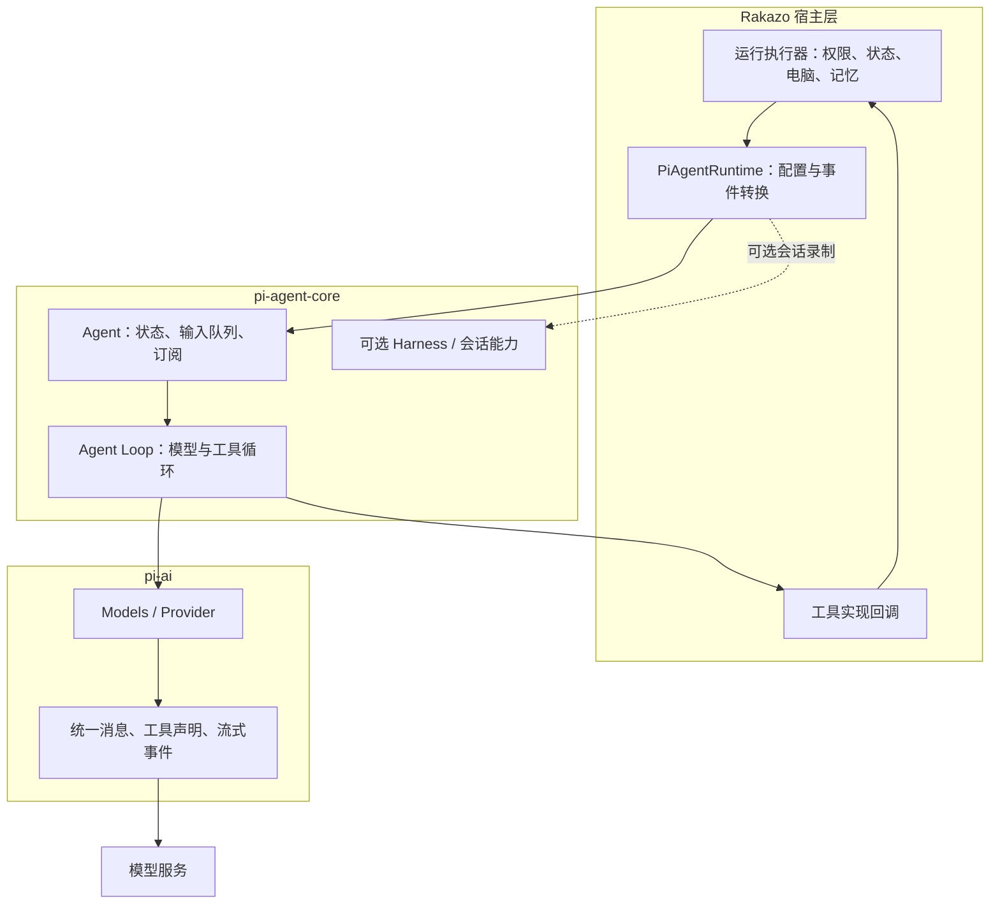
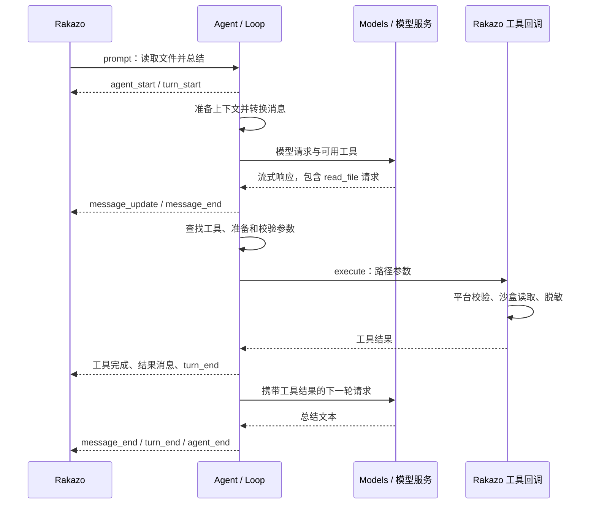

# Pi 设计理念与架构分析

Pi 为应用提供统一的模型访问和可嵌入的智能体运行能力。Rakazo 使用其中的运行库推进模型与工具循环，再通过自己的执行器连接权限、数据库、电脑和后台任务。

本文面向研究 Rakazo 的开发者，分析基线是仓库锁定的 `@earendil-works/pi-ai@0.87.1` 和 `@earendil-works/pi-agent-core@0.87.1`。版本依据见[依赖清单](../packages/adapters/package.json)和[锁文件](../pnpm-lock.yaml)。实现细节以这两个版本的代码为准；上游主分支的新增模块不能直接视为本项目已经使用的能力。

## 1. Pi 指的是哪一层

| 名称 | 定位 | Rakazo 如何使用 |
| --- | --- | --- |
| Pi 项目 | 包含模型库、智能体运行库、编码助手等组件的项目 | 使用其中部分库 |
| `pi-ai` | 模型、提供商、上下文、工具声明和流式协议的统一接口 | 解析模型、注册兼容连接、发送请求 |
| `pi-agent-core` | Agent 状态、运行循环、工具调度、事件，以及 Harness/会话相关能力 | 创建 `Agent`，订阅事件并提供工具实现 |
| 编码助手 CLI | 面向终端用户的应用层 | 当前机器人运行路径没有启动 Pi CLI |
| Rakazo `PiAgentRuntime` | Rakazo 自己的适配器 | 将平台请求转换为 Pi 调用，再把事件转换回来 |

所以，理解 Rakazo 的 Pi 接入应从 `pi-ai` 和 `pi-agent-core` 入手。CLI 的终端界面、交互命令和扩展加载方式不是这条路径的必备前置知识。

版本化资料：[Agent 包说明](https://github.com/earendil-works/pi/blob/v0.87.1/packages/agent/README.md)、[模型包说明](https://github.com/earendil-works/pi/blob/v0.87.1/packages/ai/README.md)。

## 2. 设计理念与取舍

以下是根据公开接口和实现归纳的设计取舍，不作为作者动机的原话引用。

### 2.1 把模型差异放在提供商边界

应用面向统一的模型和消息结构；提供商实现处理具体请求、认证、内容格式和流式响应。`Models` 集合可注册提供商并查找模型，调用方可以只加载需要的提供商，也可以加载内建集合。

这降低了切换模型时的业务改动，但没有消除能力差异：上下文窗口、图片输入、思考选项、工具协议和错误行为仍要正确配置和验证。一个兼容端点可连通，也不代表其模型能够可靠使用工具。

### 2.2 用运行库承载循环，让宿主提供业务能力

`Agent` 包装低层运行循环，保存当前消息和运行状态。宿主提供模型流函数、工具实现、初始上下文与事件订阅者，因此可以把循环嵌入服务器或其他应用。

收益是业务无需自己拼接每一轮模型请求；代价是宿主仍须处理访问范围、工具副作用、持久化和进程故障。`Agent` 是进程中的对象，不是自动获得隔离和恢复能力的独立服务。

### 2.3 区分应用消息与模型输入

应用可能有模型不需要看到的内部消息。Pi 用 `AgentMessage` 表达运行侧消息，在模型边界转换为模型协议消息；上下文转换钩子允许裁剪、补充或重新组织请求内容。

这种设计把显示、运行状态和模型输入之间的转换显式化。转换策略也因此成为需要测试的逻辑：删除关键工具结果或破坏调用 ID 对应关系，都可能使后续请求无效。

### 2.4 用事件与钩子连接应用

Pi 发出消息、轮次和工具生命周期事件，并允许宿主在请求准备、工具调用和轮次结束时介入。应用可以流式显示进度、接入持久化或调整上下文。

事件处理也影响运行时间：该版本的 `Agent.subscribe()` 会等待订阅者。因此持久化订阅者可以参与完成时序，缓慢订阅者也可能拖慢执行。

上述行为可从[Agent 实现](https://github.com/earendil-works/pi/blob/v0.87.1/packages/agent/src/agent.ts)与[运行循环](https://github.com/earendil-works/pi/blob/v0.87.1/packages/agent/src/agent-loop.ts)核对。

## 3. 分层架构



图中虚线仅表示 Rakazo 使用包中的会话相关能力，不表示它通过完整 `AgentHarness` 驱动主循环。当前主路径显式创建的是 `Agent`。

### 3.1 模型层：pi-ai

| 概念 | 作用 |
| --- | --- |
| Provider | 提供模型目录、认证及协议相关实现 |
| Models | 管理提供商集合、查找模型、调用统一流式接口 |
| Model | 某个模型的标识、API 类型、输入能力和限制等元数据 |
| Message | 规范化消息，包括该版本支持的 system、user、assistant、toolResult |
| Tool | 告诉模型有哪些工具、名称和参数 schema |
| AssistantMessageEvent | 模型输出流中的文本、思考、工具参数及终止事件 |

工具声明不等于执行函数。`pi-ai` 负责把声明带入模型协议，具体工具执行由上层运行库与宿主提供。

该版本同时有便利输入 `Context` 与规范化的 `TranscriptContext`。进入流函数时，系统提示和工具声明可以表达在 transcript 的 system 消息中；不能仅根据旧例子假设它们一直位于独立顶层字段。

源码：[模型消息类型](https://github.com/earendil-works/pi/blob/v0.87.1/packages/ai/src/types.ts)、[模型包](https://github.com/earendil-works/pi/tree/v0.87.1/packages/ai)。

### 3.2 智能体层：Agent 与 Loop

`Agent` 管理消息、当前模型、工具列表、流式状态、待执行工具以及排队输入。它提供 `prompt()`、`continue()`、`steer()`、`followUp()`、`abort()` 和事件订阅等入口。

低层循环负责选择待处理输入、请求模型、收集完整响应、执行工具、追加结果，并判断是否开始下一轮。运行中的同一 Agent 不能任意再次调用 `prompt()`；新输入应按需要使用队列接口或等待当前运行完成。

### 3.3 Harness 与会话能力

`0.87.1` 的 agent 包还导出 `AgentHarness`、会话仓库、分支、上下文压缩、技能和执行环境等能力。它不只有一个简单循环，但这些导出不会因为创建 `Agent` 就全部自动启用。

Rakazo 主路径使用 `Agent` 和自己的运行执行器。可选录制使用 `JsonlSessionRepo`、分支与 `NodeExecutionEnv` 等会话能力；业务 Run、作业恢复和长期记忆仍由 Rakazo 管理。

源码：[包导出](https://github.com/earendil-works/pi/blob/v0.87.1/packages/agent/src/index.ts)、[Rakazo 会话接入](../packages/adapters/src/pi-session.ts)。

## 4. 一次任务怎样推进

### 4.1 先分清四种粒度

| 概念 | 含义 |
| --- | --- |
| Agent | 持有当前状态、配置和队列的运行对象 |
| 一次 Agent 运行 | 由 prompt/continue 驱动，可能经过多个 turn |
| Turn | 一次模型回复以及该回复引发的工具处理；请求层重试可能包含在其中 |
| Message / Tool Call | 消息及其中的工具请求，一轮可能产生多个工具调用 |

Rakazo 的持久化 Run 是宿主业务对象，不应与 Pi 的一次 turn 或内存对象混用。

### 4.2 正常工具往返



模型先提出工具请求，执行结果再反馈给模型。这种循环支持多步任务，但不保证模型选择的每一步正确。图中省略了错误、审批等待、取消和排队输入。

### 4.3 请求上下文的转换

```text
已选输入与现有 transcript
  → prepareRequest（可替换请求上下文或模型配置）
  → transformContext（裁剪或补充 AgentMessage）
  → convertToLlm（转为模型消息）
  → normalizeContext
  → 提供商请求
```

实际默认转换函数保留 `system`、`user`、`assistant`、`toolResult`，自定义角色需由应用处理。Agent README 的概念段落没有完整枚举 system；此处以 `agent.ts` 和 `pi-ai` 类型实现为准。

执行工具后，结果进入后续上下文，循环再请求模型。`finishTurn` 可要求结束或确保继续一轮；持续无条件返回继续会造成循环不结束。错误和中止响应仍走硬退出，不能靠这个钩子强行继续。

### 4.4 运行期间输入新指令

`steer()` 用于在运行中的正常轮询边界引入新输入，例如用户补充“只读前三个文件”。它不会自动撤销已经执行的动作，也不是随时抢占正在运行的工具。

`followUp()` 用于在当前循环自然准备停止时继续处理后续输入。两种队列都可配置一次消费一条或全部；Rakazo 主 Agent 显式使用 `steeringMode: "all"`，从平台持久化输入中领取补充消息再送入 Pi。

`continue()` 根据已有消息与排队输入推进执行，不等于可以任意重复上一次工具。低层 `agentLoopContinue` 对末尾消息有约束；Agent 包装层还会处理 assistant 结尾时的队列回退，调用者应区分两层 API。

## 5. 工具调度与事件语义

### 5.1 参数、执行和结果

一次普通工具处理依次涉及：查找工具 → 可选参数预处理 → schema 校验 → `beforeToolCall` → `execute` → `afterToolCall` → 完成事件与结果消息。

`tool_execution_start` 在参数校验之前即可发出，所以界面看到开始事件不证明实际外部动作已经发生。缺少工具、无效参数和执行异常可以被转换为错误工具结果，供后续模型判断。

若模型因输出长度限制结束，本版本不会执行该消息中可能被截断的工具参数，而是生成失败结果。这样避免把看似部分有效的参数当作完整动作执行。

### 5.2 并发顺序

本版本默认 `toolExecution: "parallel"`：预检查按调用顺序完成，允许执行的工具并发运行。完成事件按实际完成时刻产生，而最终工具结果消息按模型原始调用顺序排列。

全局可选择顺序执行；一批调用中只要有工具声明 `executionMode: "sequential"`，整批就顺序执行。对共享文件或有依赖关系的操作，宿主仍需设计合适的串行与并发规则。

工具结果或钩子可给出 `terminate: true`。只有该批最终结果全部要求终止，才会跳过自动工具后续轮；混合批次不能因一个结果要求停止就推断整批结束。

实现依据：[工具批处理与参数校验](https://github.com/earendil-works/pi/blob/v0.87.1/packages/agent/src/agent-loop.ts)。

### 5.3 三种事件不要混淆

| 事件层 | 例子 | 含义 |
| --- | --- | --- |
| 模型响应流 | `text_delta`、`toolcall_delta`、`done` | 一次模型输出的增量与终止 |
| Pi Agent | `turn_end`、`tool_execution_end`、`agent_end` | 智能体循环的生命周期 |
| Rakazo 运行事件 | `progress`、`tool`、`done` 等适配事件及产品事件 | 平台转换、持久化与界面更新 |

模型流结束后可能还要执行工具并再次请求模型。`agent_end` 也只是 Pi 不再发出循环事件；等待 `prompt()` 或 `waitForIdle()` 才会涵盖被等待的结束订阅者完成。它不直接证明 Rakazo 的数据库事务已经完成。

## 6. 异常、取消和安全边界

| 情况 | Pi 运行层的关注点 | 宿主仍需负责 |
| --- | --- | --- |
| 模型错误或流中断 | 错误响应与循环退出 | 错误展示、运行状态、是否允许重新发起 |
| 工具返回错误 | 形成工具结果，后续可能继续请求模型 | 是否有外部副作用、应否重试 |
| 用户取消 | 传播 AbortSignal，停止后续推进并等待收尾 | 工具是否响应取消、已发生动作如何处理 |
| 进程退出 | 内存循环无法继续 | 作业、租约、持久化恢复 |
| 工具被钩子阻止 | 阻止本次回调 | 用户授权策略、审计与隔离 |

`abort()` 是合作式取消。已经提交的远程操作不一定可撤销，忽略信号的工具也可能继续运行。Rakazo 因此同时管理主 Agent、子 Agent、异步迭代器和运行状态。

工具钩子不是 OS 沙盒。具有文件、进程或网络能力的回调，其实际权限来自执行环境；多租户权限、秘密处理和电脑隔离必须由宿主落实。Rakazo 的对应机制见[平台架构](architecture.zh-CN.md)。

## 7. Rakazo 实际增加了什么

主接入点是 [PiAgentRuntime](../packages/adapters/src/pi-runtime.ts)，其对外实现 [AgentRuntime 契约](../packages/adapter-kit/src/interfaces.ts)。执行器提供请求，适配器创建 Agent 并转换事件。

| 需求 | Pi 提供 | Rakazo 的当前接入 |
| --- | --- | --- |
| 模型调用 | 模型集合与协议接口 | 连接解析、凭据、兼容端点、流可靠性包装 |
| 工具循环 | 工具 schema、执行回调、结果继续 | 内建工具、审批、电脑和连接器的实际操作 |
| 请求上下文 | 转换钩子 | 裁剪过期页面状态与电脑截图，处理图片上限 |
| 运行中输入 | steering / follow-up 队列 | 领取持久化补充输入，投递异步 shell 完成结果 |
| 子智能体 | 可创建多个 Agent 对象 | `run_subagent` 的调度、并发门限和子工具限制 |
| 工具预算 | 可由宿主控制执行 | 进程内调用预算、超限处理及结果裁剪 |
| 任务恢复 | 循环与会话相关构件 | PostgreSQL Run、Graphile、租约、副作用状态 |
| 长期记忆 | 可接入上下文和会话机制 | 基础记忆与可选语义记忆提供商 |
| 会话记录 | JSONL 等会话能力 | 显式开启的录制适配器 |

几个会影响二次开发的具体实现：

- `streamFn` 使用 Rakazo 的 `reliableModelStream` 包装，配置超时、输出限制等行为；不能把所有超时策略归为 Pi 默认值。
- `transformContext` 清理旧页面状态和截图；`finishTurn` 将完成的异步 shell 信息送到 follow-up 队列。
- 工具有 `prepareArguments` 预处理。因此新增参数时，除了改工具 schema 和执行器，还要核对预处理是否丢弃该字段。
- 子智能体由 Rakazo 再创建 Agent，并限制子工具集。当前子智能体最大并发常量为 4，这是接入实现的策略。
- 工具预算保存在进程内，同一业务 Run 换到另一个 Worker 后不能假设计数天然延续。
- 对工具完成后没有最终回答的特定情况，Rakazo 有有限次数的内部继续策略，这是额外的兼容处理。

这些细节可沿 `new Agent`、`toAgentTools`、`prepareArguments`、`run_subagent`、`toolCallBudgetsByRun` 等符号阅读；它们属于当前版本实现，后续升级应重新核对。

### 会话录制不等于业务持久化

Rakazo 默认不记录 Pi JSONL。显式开启 `PI_SESSION_RECORDING=true` 后，会话录制使用 `DATA_DIR/pi-sessions` 下的目录，并通过 Pi 会话仓库写入消息。当前录制未加密，且有保留策略。

不启用录制不代表聊天记录不保存：Thread、Message、Run 由 Rakazo 数据库管理。录制也不能替代作业恢复、工作区文件备份和长期记忆。

源码：[录制实现](../packages/adapters/src/pi-session.ts)、[Worker 组装](../apps/worker/src/index.ts)。

## 8. 如何阅读、验证和扩展

### 推荐阅读顺序

1. 阅读本版本 `pi-ai` 消息与工具类型，理解提供商边界。
2. 阅读 `Agent` 的构造、状态、prompt/continue、队列与取消。
3. 阅读 `agent-loop` 的 `runLoop`、`streamAssistantResponse`、工具预检查和执行。
4. 回到 Rakazo 的 `new Agent` 配置与工具转换，逐项对应框架钩子。
5. 通过离线测试观察真实请求、工具结果、事件和取消路径。
6. 涉及会话存储或压缩时，再进入 Harness 与 Session，避免假设主路径使用了全部导出功能。

上游源码采用固定版本链接：

- [agent.ts](https://github.com/earendil-works/pi/blob/v0.87.1/packages/agent/src/agent.ts)
- [agent-loop.ts](https://github.com/earendil-works/pi/blob/v0.87.1/packages/agent/src/agent-loop.ts)
- [Agent 类型](https://github.com/earendil-works/pi/blob/v0.87.1/packages/agent/src/types.ts)
- [Harness 与会话](https://github.com/earendil-works/pi/tree/v0.87.1/packages/agent/src/harness)

安装依赖后也可以查看 `packages/adapters/node_modules/@earendil-works/` 下对应包的 README、`dist/*.js` 和 `dist/*.d.ts`；这些安装产物用于核对，不能直接修改它们作为功能实现。

### 离线验证

```bash
pnpm test:pi
pnpm exec vitest run packages/adapters/src/pi-runtime-models.test.ts
pnpm exec vitest run packages/adapters/src/pi-runtime-tool-dispatch.test.ts
pnpm exec vitest run packages/adapters/src/pi-runtime-cancellation.test.ts
```

上述命令是阅读后的验证入口，本分析文档不代表这些测试已在编写时运行。真实 Pi 配合本地 HTTP 模型夹具，可以验证流解析、工具往返和取消；它不能证明真实模型的任务成功率。完整说明见[智能体验证指南](agent-verification.md)。

| 你想改变什么 | 先检查哪里 |
| --- | --- |
| 某个模型请求格式 | Pi 提供商能力、Rakazo 模型与流适配 |
| 模型看到哪些历史 | 上下文构造、转换钩子、平台历史压缩 |
| 工具参数或输出 | 工具 schema、参数预处理、执行器、往返测试 |
| 用户能否执行某动作 | Rakazo 权限与审批逻辑 |
| 工具在哪台电脑执行 | SandboxProvider 与 Supervisor |
| Worker 重启后如何恢复 | Rakazo Run、作业协调器、租约和副作用记录 |

实践任务可继续参考[学习计划](learning-plan.zh-CN.md)。判断修改位置时，先区分模型协议、内存循环和持久化业务三种责任，再决定是否需要深入 Pi 本身。
