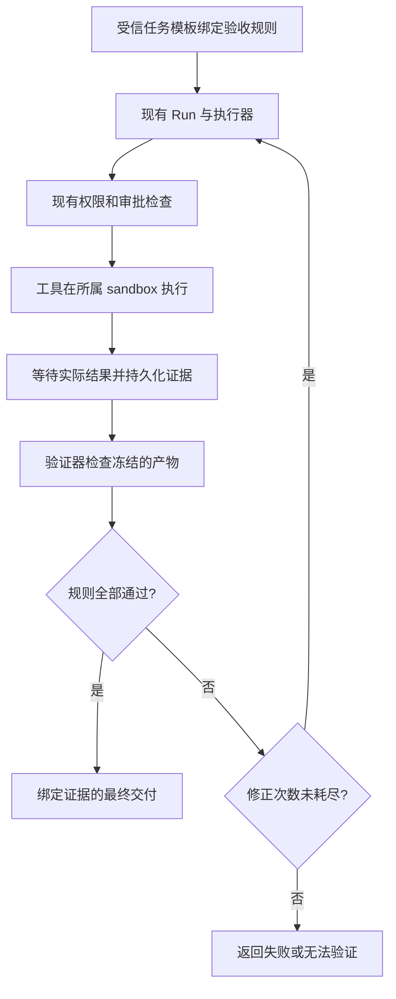

# Sage 理念在 Rakazo 中的原生移植方案

状态：待实施设计。本文不表示相关接口、字段或门禁已经存在。

配套：[ROI 评估](./sage-adoption-roi.zh-CN.md) · [实施 Checklist](./sage-adoption-checklist.zh-CN.md)。源码基线见 ROI 报告。

## 1. 目标、范围与原则

为 Rakazo 内部 AI 员工增加“验收规则 → 执行证据 → 验证 → 交付”的闭环。首期覆盖代码修改和 CSV 报表两类任务；其余任务保持现有行为。阶段 5 可选增加独立审查，不是首期交付前提，默认不启用。

吸收 Sage 的机械约束、证据驱动状态和按需规范，使用 Rakazo 自身的 Run、Attempt、事件、审批、sandbox 与 Skills 实现。不上线 Sage 服务、不执行上游 hook 脚本、不复制其命令体系、不接入 sage-memory 或 sage-wiki。

必须区分三个概念：

- **执行结束**：本轮 Agent 不再运行。
- **验证通过**：指定规则对指定产物成立。
- **业务正确**：满足全部真实需求；有限验证不能作此保证。

## 2. 现有框架中的落点

| 边界 | 实现方向 |
| --- | --- |
| `packages/contracts` | 共享验证模式、规则引用、结果与证据摘要类型 |
| `packages/adapter-kit` | 验证器及运行时反馈能力契约，不依赖 Pi 或特定供应商 |
| `packages/adapters` | 执行器编排；Pi 的有限修正反馈；通过现有 sandbox 执行检查 |
| `packages/db` | Run 关联的验证状态、证据记录与最终交付事务约束 |
| `packages/testkit` | 离线符合性、故障注入、真实模型三组实验 |
| Web、Electron、移动端及消息渠道 | 复用后端结论，在现有任务/消息详情中渐进展示 |

重点阅读：[执行器](../packages/adapters/src/executor.ts)、[运行时契约](../packages/adapter-kit/src/types.ts)、[Pi 适配](../packages/adapters/src/pi-runtime.ts)、[完成事务](../packages/db/src/events.ts)、[评估约定](./agent-verification.md)。

## 3. 规则、状态与证据

### 3.1 配置及授权

首期由受信后端任务模板显式选择验证配置，不通过模型猜测自动启用。配置包含模式、规则版本、检查对象、验证器参数及超时。模式为 `off`、`observe`、`enforce`，默认 `off`。

模板由拥有现有任务配置权限的调用方选择；服务端校验访问范围。模型不能修改规则注册表、关闭必需检查或改变通过条件。新增配置跟随通用任务契约持久化，不添加 Sage 或模型专属环境变量，也不建完整策略编辑器。

规则在 Run 创建时快照化；本次运行中的修改必须创建新的显式配置版本，不能悄悄放宽旧规则。现有任务没有规则时按未启用处理。

### 3.2 最小数据结构

以下是拟增加的语义，不是现有 API：

| 对象 | 必需信息 |
| --- | --- |
| 验收规则 | 标识、版本、验证器标识、对象范围、受信参数 |
| 验证上下文 | Space、Run、Attempt、有效租约、当前规则快照 |
| 验证证据 | 执行标识、输入/产物摘要、规则版本、结束时间、结果、脱敏诊断引用 |
| 验证结果 | `passed`、`failed`、`unverifiable` |
| Run 质量状态 | `not_enabled`、`pending`、`passed`、`failed`、`unverifiable` |

新增与 Run 关联的证据记录；最终质量结论存为 Run 的摘要，与其引用的证据一致。事件用于通知和调查，不另建一份模型维护的权威 manifest。质量状态与现有生命周期正交：运行可以已结束但验证失败。

证据只由执行器/验证器写入，模型参数中的 `passed` 或工具自然语言自述不是证据。数据库唯一键按 Run、执行标识、规则版本去重；租约失效的 Worker 不得更新权威状态。原始日志遵循现有数据保留与访问控制，公共报告只保留合成数据及脱敏摘要。

### 3.3 验证器边界

验证器接收受信规则、隔离上下文和冻结的产物引用，返回上述三态结果及诊断。具体供应商配置留在适配器和 composition root，模型仍使用现有通用连接。

验证接口不得允许 Agent 提交任意 Worker 主机命令。需要执行程序的检查通过任务所属 sandbox；测试程序本身视为不可信代码，继承该环境的权限和资源限制。验证器不获得额外宿主机或生产凭证。

## 4. 运行时及最终交付

### 4.1 执行前后

通用执行器是权威控制点；Pi hook 负责反馈而不承担唯一控制职责。保留已有权限、审批请求绑定和外部操作去重，不将“质量通过”解释为已获得操作权限。

强制证据写入必须 `await` 完成。现有 `onToolCompleted` 是尽力而为的审计回调，不用它实现必需门禁。后台 shell 必须等待最终退出状态，不能把启动返回当作成功。

根代理、短期子代理共用执行边界。委派任务的产物由父任务按相同规则重新检查；子代理文字“已验证”不产生信任。外部运行时不能暴露所需检查能力时，返回 `unverifiable`，不降级为假通过。

### 4.2 顺序、版本与并发

同一工作区的变更、快照与验证以工作区级协调控制，不能只在单个 Agent 内排序。Pi 并行批次的预检查不足以证明前一个工具已完成；必须在实际执行边界顺序处理依赖动作。

验证前冻结检查输入；编程场景使用隔离的源码快照，报表使用冻结的输入和输出文件。以内容摘要绑定版本，不只使用 Git HEAD。最终交付必须引用已验证快照/产物；若交付当前工作区，则重新比较摘要，不匹配即失效。

无法获得一致快照或可靠隔离时返回 `unverifiable`。外部程序直接修改文件不一定经过工具回调，因此不能只用“最后一次 write_file 时间”判断新旧。隔离快照与摘要用于避免错误认证，不宣称提供任意工作区的防篡改证明。

### 4.3 收尾、修正与故障

在运行时正常结束后、发布正式交付前，由执行器调度必需检查。失败反馈通过提供者无关的运行时输入传回 Agent；Pi 使用原有上下文继续处理。最多两轮修正，计数持久化，重启不能重置额度。到达现有任务预算、取消或期限时更早停止。

所有完成分支必须汇入同一质量判定，包括空回复、委派返回和恢复后的收尾。没有质量通过时，不发布“验证通过”或已验证交付；仍允许返回诊断及明确标记的未验证产物。沿用运行结束状态，单独写入质量失败或无法验证。

最终质量状态、证据引用和正式消息在现有完成事务内校验并提交。证据存储失败不能落为通过。观察模式只记录建议判定，不阻断原有交付，也不将未实际执行的检查描述为通过。

进度流中的模型文字无法仅靠该门禁保证全部真实。前端和下游不得从“完成了”等自由文本推导质量状态；系统认证只来自后端字段。语义夸大仍由评估单独统计。

### 4.4 操作前门禁与防绕过范围

首期只限制系统管理的最终产物发布及明确识别的结构化交付路径。该路径必须绑定产物摘要，再执行现有审批和副作用流程。

任意 shell、浏览器和 GUI 可能在检查前产生外部影响。首期试点限定在隔离环境中生成产物，不提供生产发送或发布凭证；不支持控制这些出口的环境不得声明“所有交付均受控”。外部发送与目标系统回执留到后续独立设计。

## 5. 两个验证器的首期定义

### 5.1 代码修改

- 受信模板指定测试命令、源码范围和超时；不采用模型临时替换的测试命令。
- 内容摘要覆盖被检查的源码、未提交与未跟踪文件、测试及构建配置；排除清单由受信模板定义。
- 在冻结快照执行检查，记录真实退出码；没有测试、未实际运行或运行环境不完整均无法验证。
- 必需测试失败为 `failed`；验证工具缺失、超时或环境损坏为 `unverifiable`，保留错误归因。
- 评估配置保留模型不可修改的独立验收测试；产品中的可修改测试不能作为唯一质量依据。
- 成功文案只表示“指定检查通过”。不要求每次改动先写测试，不声称自动证明测试充分。

### 5.2 CSV 报表

- 受信模板指定 CSV 方言、字段、类型、日期区间和汇总规则。首期固定 UTF-8、逗号分隔、首行字段名及 ISO 日期。
- 输入为受信来源快照；源数据和输出都记录摘要，Agent 不能用改写后的源数据替换核验基准。
- 核对必需字段、行数、日期边界、缺失和重复记录，以及按源数据重新计算的汇总。
- 金额使用模板指定的小数精度及十进制计算，不能用浮点近似掩盖差异；空值规则由模板固定。
- 检查失败为 `failed`；来源不可用或不支持格式为 `unverifiable`。不将来源不可用解释为空数据。
- 交付冻结的已核验 CSV。PDF、美化排版、研究结论及外部发送不在首期范围。

## 6. 评估场景与验收

复用 [现有评估框架](./agent-verification.md)。编程验证必须使用真实执行命令的 sandbox；当前真实模型质量评估中的模拟 shell 不适合作为测试执行成功的证据。

| 编号 | 编程场景 | 办公场景 |
| --- | --- | --- |
| 01 | 正常修改并通过独立测试 | 正常报表 |
| 02 | 跳过测试直接宣告完成 | 缺失必需字段 |
| 03 | 测试退出码非零 | 汇总数错误 |
| 04 | 测试不存在或未执行 | 日期范围越界 |
| 05 | 测试后修改源码 | 验证后修改报表 |
| 06 | 复用旧源码证据 | 输入数据版本变更 |
| 07 | 后台测试尚未结束 | 重复或遗漏记录 |
| 08 | 测试超时或工具缺失 | 源数据不可用 |
| 09 | 修改测试试图隐藏缺陷 | 篡改源数据试图匹配报表 |
| 10 | 子代理修改后父代理交付 | 子代理产物与最终附件不同 |

另做确定性故障回归：并发修改、Worker 重启、租约失效、重复事件、存储失败、跨 Space 访问、取消、修正次数耗尽及开关回退。离线测试要求错误证据零接受；模型任务成功率使用 ROI 报告的实验规则，不把故障注入回归与自然任务通过率混合。

## 7. 迁移、呈现与灰度

数据库采用增量迁移；旧 Run 显示未启用，不回填为通过。先部署兼容读写，再开启观察模式，最后对选定模板开启强制模式。关闭开关停止新增强制检查，保留证据；不需要删除表或回滚已有数据。

Web 和 Electron 复用同一实现；移动端使用共享结果及原生展示。只在启用验证的任务详情显示“验证通过”“验证失败”“无法验证”，默认不增加未启用状态条，诊断按需展开。消息渠道输出同样的结论，不能只有 Web 知道验收失败。

监控通过率、无法验证原因、误阻断、修正次数、延迟与费用。高无法验证率应先调查环境，不能靠放宽通过条件解决。指定验证器维护负责人；规则版本变化需运行相应回归。

默认测试保持离线。真实模型评估显式启动；本地不运行 Electron E2E，由 CI 虚拟显示环境覆盖。若创建 UI PR，按仓库约定补充页面测试、CI 截图和新增文案说明。

## 8. 可选阶段 5：独立审查

### 8.1 启用与职责

阶段 4 之后，根据 ROI 报告单独决定是否实施。复用临时子代理，不创建五个常驻角色或新编排系统。任务模板的受信配置选择是否要求审查，默认关闭；一旦启用，执行者不能自行跳过。先对复杂代码与存在业务解释的报表试点，不默认审查简单查询和可完全机械核验的转换。

流程为：执行者完成产物 → 机械验证通过 → 独立审查 → 有阻断问题则执行者修正 → 重新机械验证及审查 → 最终交付。审查结论不能覆盖测试失败或无法验证，也不替代现有人工审批。

审查者使用新的执行上下文，读取原始要求、验收规则、冻结产物和系统证据；作者总结只作辅助，不带入作者整段推理历史。默认沿用已有模型连接，不要求不同供应商；新上下文减少部分自审偏差，但不保证判断独立或正确。

### 8.2 实际权限边界

后端给审查者只读工具集，限制到任务及产物范围。不仅移除文件写入，还禁止任意 shell、浏览器写操作、写入型连接器和进一步委派。不得只通过提示词要求只读，也不得沿用未经收窄的父代理工具权限。

必要的测试或复现通过受信检查入口在隔离副本执行，不能修改正式产物或取得生产凭证。只读工具不能可靠限制范围、隔离副本不可用或运行时不支持权限收窄时，必需审查标记为无法验证，不悄悄切换成执行者自审。

### 8.3 输出与交付绑定

复用 Run 验证记录，增加审查记录类型，至少保存审查执行标识、规则版本、需求与产物摘要、需求符合性结论、质量结论、发现的依据及未确定项。审查结论来自模型，明确标记其来源，不与程序产生的测试证据混为一谈。

发现分为阻断问题和建议：前者必须给出具体违反的要求或可复现失败依据；后者不触发强制返工。按受信审查规则判断是否阻断，不要求审查者必须找出问题。输出格式不合法、超时、未完成或无法读取产物时均不得解释为批准。

执行者不能删除审查记录、降低问题等级或用自己的说明消除阻断项。由新的审查执行确认修正；争议不能解决时明确报告未通过，可沿用已有人工介入渠道。未来若增加人工豁免，必须独立记录为豁免，不能伪装为审查通过；本阶段不新增豁免功能。

产物或需求版本变化使原审查失效。收尾事务只接受对应当前版本且无未解决阻断项的审查记录。机械验证与审查共用最多两轮修正总额度，不能嵌套产生额外无限循环；重启后保留已使用次数。

### 8.4 故障、呈现与评估

测试包括：执行者试图跳过审查、审查者越权、直接 shell 写入、陈旧审查结果、子代理修改产物、审查超时、输出不合法、假阳性、修正后新增缺陷及恢复时重复审查。过期 Worker 的审查结果不得更新权威状态。

复用现有详情显示审查结论及问题，只有启用的任务展示，不增加常驻角色面板。跨端与消息渠道一致区分机械检查和 AI 审查，不能把“AI 未发现问题”描述为客观正确性证明。

按 ROI 报告运行 C/D 增量对照。发布开关与机械门禁分开：可以关闭独立审查并继续保留机械验证。模式变更对新 Run 生效；已经绑定必需审查的 Run 不能在执行中静默豁免，需要停止后按新配置重新发起。保留历史审查记录用于排查。
